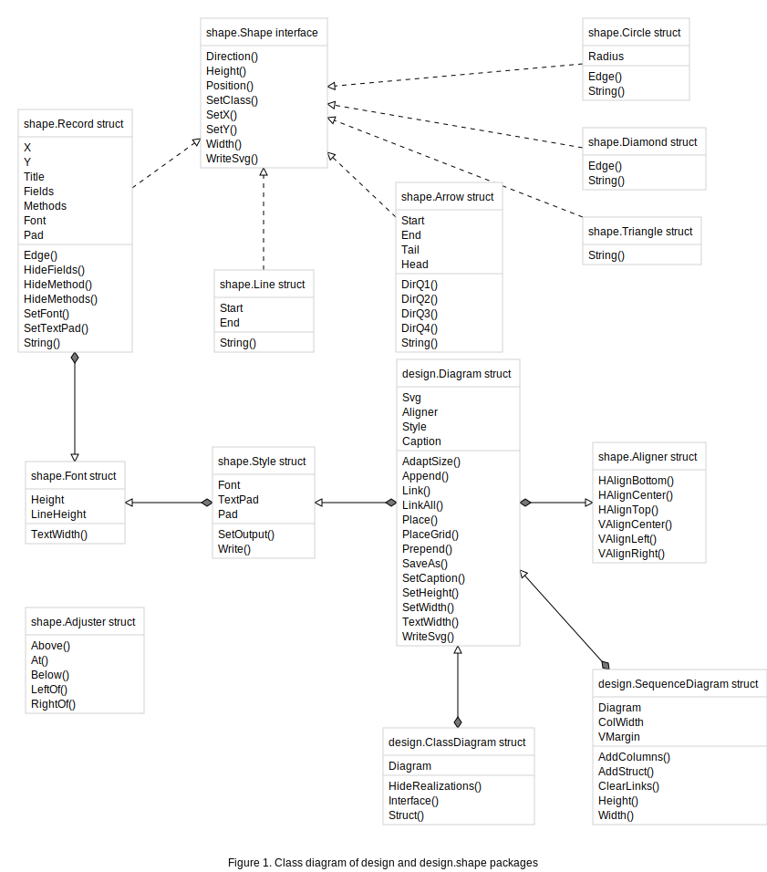

[go-design](https://godoc.org/github.com/gregoryv/go-design) - package for writing software design diagrams in code

Wouldn't it be nice if gofmt also updated all diagrams while you are
refactoring?  If the diagrams are code, it would. This package allows
you to easily create various diagrams as a program.

Diagrams and shapes are all in SVG which is good enough for most
purposes.

WIP - major refactorings still going on

## TODO

- Arrows ought to point towards the center of shapes in class diagrams.
- Labeled arrows
- Optionally hide methods that implement an interface if it's part of
  the diagram, minimizing duplication.
- Link to optional godoc service
- More shapes
    - Note
    - Circle

## Class diagram

This diagram is rendered by
[example_test.go/ExampleClassDiagram](https://godoc.org/github.com/gregoryv/go-design/#example-ClassDiagram)

With hidden fields and methods and different placement.
This diagram is rendered by
[example_test.go/ExampleVerticalClassDiagram](https://godoc.org/github.com/gregoryv/go-design/#example-VerticalClassDiagram)

## Sequence diagram

From [example_test.go/ExampleSequenceDiagram](https://godoc.org/github.com/gregoryv/go-design/#example-SequenceDiagram)

## Generic diagram

It should be easy to just add any extra shapes to any diagram when explaining a design.
This diagram is rendered by
[example_test.go/ExampleDiagram](https://godoc.org/github.com/gregoryv/go-design/#example-Diagram)

